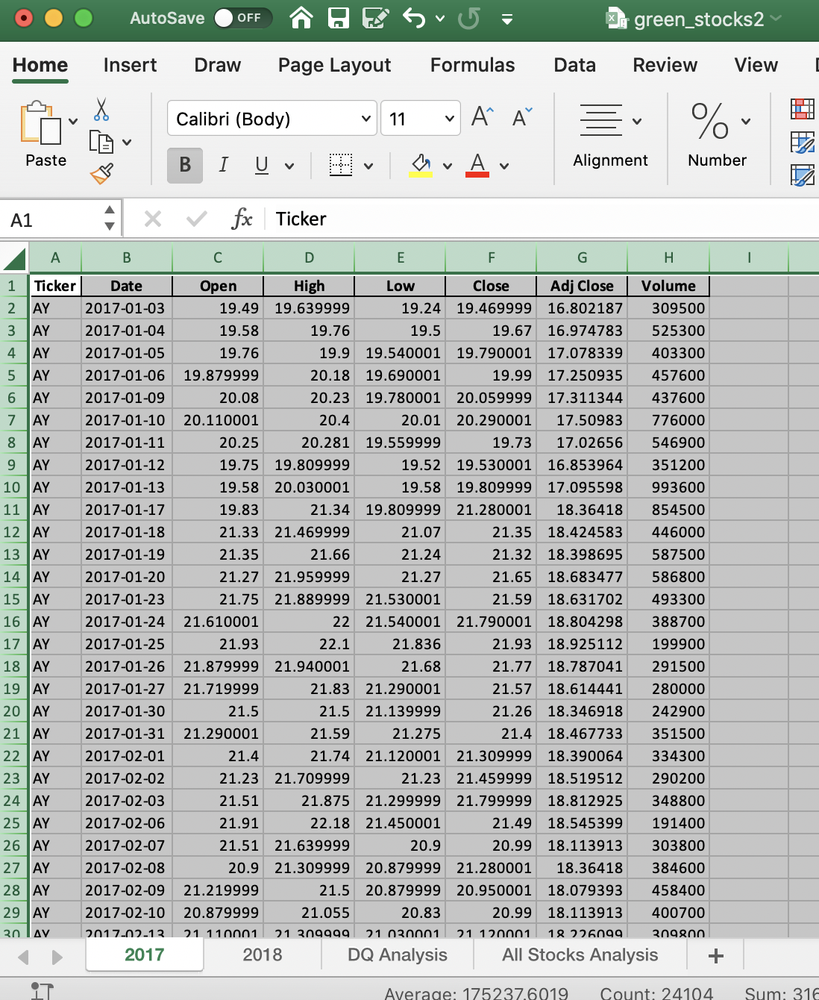
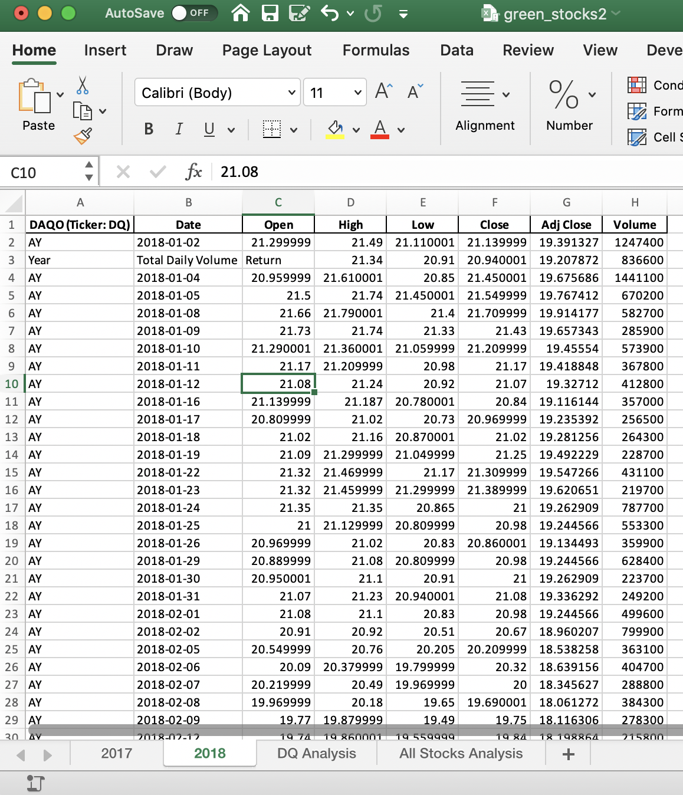
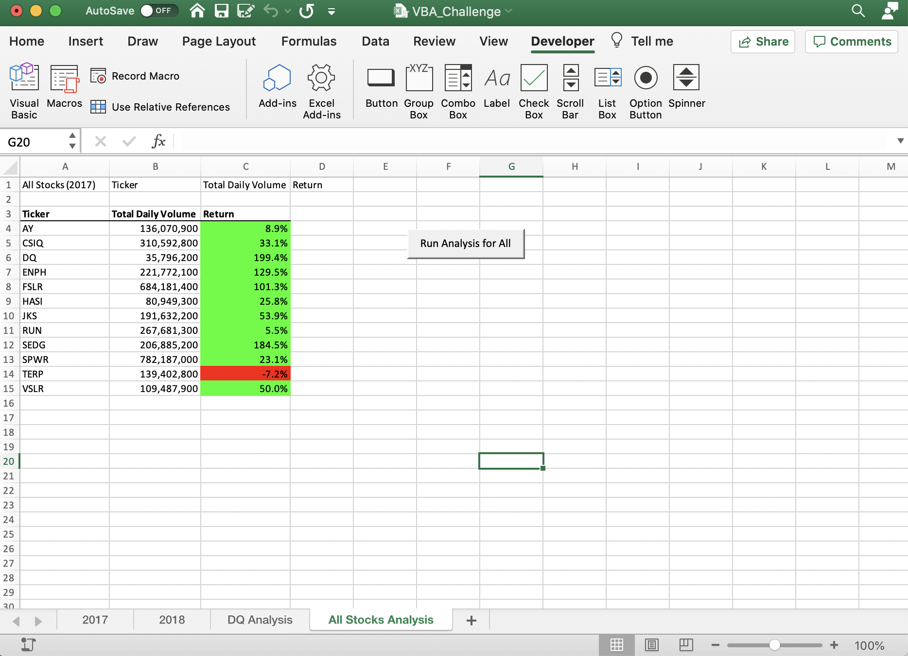

        STOCK MARKET ANALYSIS FOR YEARS 2017 AND 2018 

 The purpose of this analysis is to find the performance of the stoks markets during years 2017 and 2018.

ANALYSIS

To perform the analysis for the stokcs performance during years 2017 and 2018, a loop was created based on the information provided, that information shows us some variables which help us to have a better understanding about the stocks performance. 
                                                
                                                
                                                
                                                
                                                
    

                      

To start teh analysis we can see in the data provided that the open and close price doesn't have much variation. Later on we will se how the behavior of the return value was.

Ater run the loop to obtain the return performance we can compare between 2017 and 2018

 

The total Stocks Daily Volume is bigger during 2017. I notice that year 2017 had a better Stocks return, is noticed that just TERP was the only company that had a negative return.

On the other hand, the stocks had a bad return in 2018, just two companies could have a good return.
