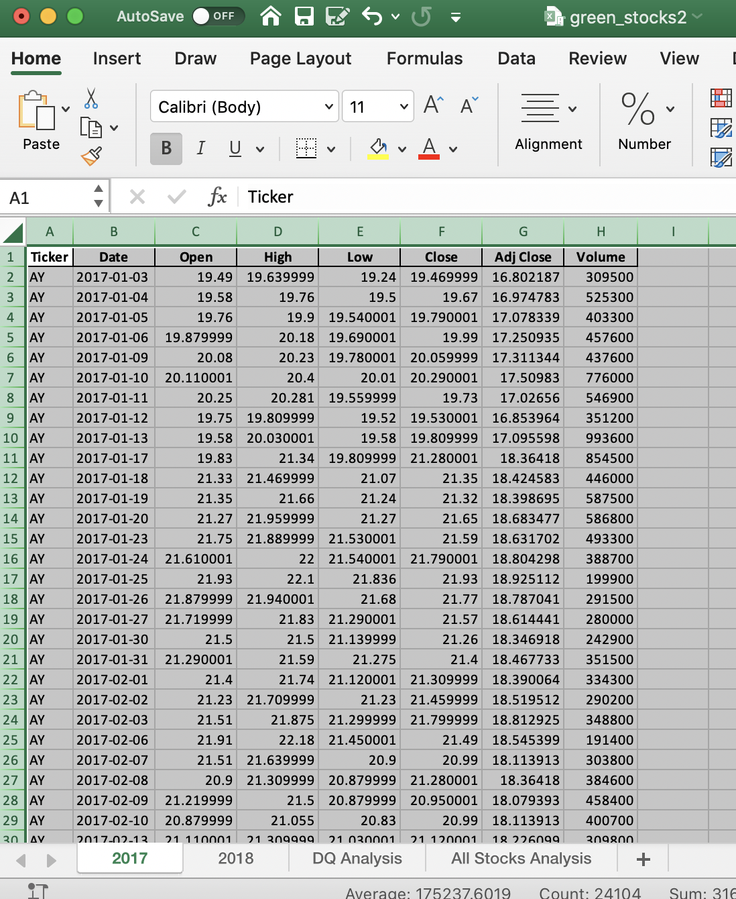

        STOCK MARKET ANALYSIS FOR YEARS 2017 AND 2018 

 The purpose of this analysis is to find the behavior stoks markets during years 2017 and 2018.

ANALYSIS

To perform the analysis for the stokcs behavior during years 2017 and 2018, a loop was created based on the information provided, that information shows us some variables which help us to have a better understanding about the stocks behavior. 

### Analysis of Outcomes Based on Goals
To perform the analysis, I use outcom column to see the percentage of people who goes to theater. 
To do this I use a column with the goals of number of people that should go to theater, and the percentage of the number of people that goes to theater to see the results graphycally. 

In that way easily you can see the range of people to go to theater.

### Challenges and Difficulties Encountered
Understand many concepts, I didn't use Excel in a long time
## Results

- What are two conclusions you can draw about the Outcomes based on Launch Date?
People goes more to theater on May, may be because the weather is good (spring), after May the amount of pleaple start decreasing during next months, but at the end of the year less people go to theater, but anyway some people go.

The cancelations are stables during all year long, the cancelation are low all year long.

- What can you conclude about the Outcomes based on Goals?
Percentage of peolple who goes to theater decrease when the number of people increase
Percentange of people who don't go to theater increase when the number of people increase

- What are some limitations of this dataset?
May be more descriptive columns.

- What are some other possible tables and/or graphs that we could create?
People income, Distance from home to theater, transportation to theater.